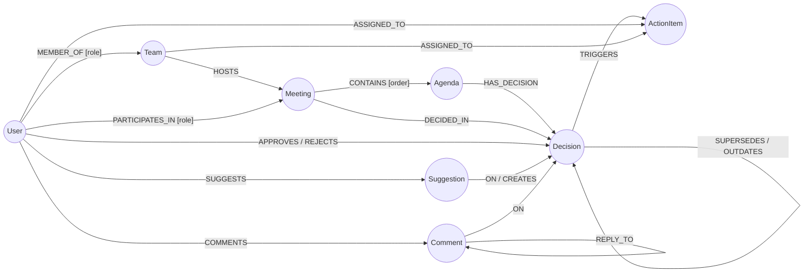

# Neo4j Schema Setup

MIT 그래프 데이터베이스 스키마 정의 및 데이터 구축

## 1. 스키마 개요

### 노드 타입

| Node | 속성명 (Key) | 타입 (Type) | 필수 | 설명 |
|------|-------------|-------------|------|------|
| **Team** | id | string (UUID) | O | 고유 식별자 |
| | name | string | O | 팀 이름 |
| | description | string | X | 팀 설명 |
| **User** | id | string (UUID) | O | 고유 식별자 |
| | email | string | O | 이메일 (unique) |
| | name | string | O | 사용자 이름 |
| **Meeting** | id | string (UUID) | O | 고유 식별자 |
| | title | string | O | 회의 제목 |
| | status | string (enum) | O | scheduled / ongoing / completed / in_review / confirmed / cancelled |
| | description | string | X | 회의 설명 |
| | summary | string (text) | X | 회의 요약 |
| | summary_embedding | list (vector) | X | 요약문 검색용 벡터값 |
| | team_id | string (UUID) | O | 소속 팀 ID |
| | scheduled_at | datetime | X | 예정 시각 |
| | started_at | datetime | X | 시작 시각 |
| | ended_at | datetime | X | 종료 시각 |
| | created_at | datetime | O | 생성 시각 |
| **Agenda** | id | string (UUID) | O | 고유 식별자 |
| | topic | string | O | 안건 주제 (예: "Q1 마케팅 예산") |
| | description | string | O | 안건 설명 |
| | embedding | list (vector) | X | 유사 안건 병합용 임베딩 |
| | team_id | string (UUID) | O | 소속 팀 ID |
| | created_at | datetime | O | 생성 시각 |
| **Decision** | id | string (UUID) | O | 고유 식별자 |
| | content | string (text) | O | 결정 내용 (예: "예산 5천만 원 확정") |
| | status | string (enum) | O | draft / latest / outdated / superseded / rejected |
| | context | string (text) | O | 결정 맥락/사유 |
| | meeting_id | string (UUID) | X | 결정이 생성된 Meeting 스코프 |
| | team_id | string (UUID) | O | 소속 팀 ID |
| | created_at | datetime | O | 생성 시각 |
| | updated_at | datetime | X | 수정 시각 |
| **ActionItem** | id | string (UUID) | O | 고유 식별자 |
| | content | string (text) | O | 할 일 내용 |
| | due_date | datetime | X | 마감일 |
| | status | string (enum) | O | pending / in_progress / completed / cancelled |
| | meeting_id | string (UUID) | O | 생성된 회의 ID |
| | team_id | string (UUID) | O | 소속 팀 ID |
| | created_at | datetime | O | 생성 시각 |
| **Suggestion** | id | string (UUID) | O | 고유 식별자 |
| | content | string (text) | O | 수정 제안 내용 |
| | status | string (enum) | O | pending / accepted / rejected |
| | author_id | string (UUID) | O | 작성자 User ID |
| | decision_id | string (UUID) | O | 대상 Decision ID (ON 관계) |
| | created_decision_id | string (UUID) | X | 생성된 새 Decision ID (CREATES 관계) |
| | meeting_id | string (UUID) | O | 제안이 생성된 Meeting ID |
| | team_id | string (UUID) | O | 소속 팀 ID |
| | created_at | datetime | O | 생성 시각 |
| **Comment** | id | string (UUID) | O | 고유 식별자 |
| | content | string (text) | O | 댓글 내용 |
| | author_id | string (UUID) | O | 작성자 User ID |
| | decision_id | string (UUID) | O | 대상 Decision ID |
| | parent_id | string (UUID) | X | 부모 Comment ID (대댓글용) |
| | pending_agent_reply | boolean | X | @mit 멘션 시 AI 응답 대기 플래그 |
| | team_id | string (UUID) | O | 소속 팀 ID |
| | created_at | datetime | O | 생성 시각 |

### 관계 타입

| 시작 Node | Edge | 종료 Node | 속성명 (Key) | 타입 (Type) | 필수 | 설명 |
|-----------|------|-----------|-------------|-------------|------|------|
| User | MEMBER_OF | Team | role | string (enum) | O | owner / admin / member |
| Team | HOSTS | Meeting | - | - | - | 팀이 회의를 주최 |
| User | PARTICIPATES_IN | Meeting | role | string (enum) | O | host / participant |
| Meeting | CONTAINS | Agenda | order | integer | O | 해당 회의에서의 안건 순서 |
| Meeting | DECIDED_IN | Decision | - | - | - | 결정이 생성된 회의 스코프 |
| Agenda | HAS_DECISION | Decision | - | - | - | 안건이 결정사항을 가짐 |
| User | APPROVES | Decision | - | - | - | 사용자가 결정 승인 |
| User | REJECTS | Decision | - | - | - | 사용자가 결정 거절 |
| Decision | SUPERSEDES | Decision | - | - | - | 새 draft가 이전 draft 대체 |
| Decision | OUTDATES | Decision | - | - | - | 새 latest가 이전 latest 대체 |
| Decision | TRIGGERS | ActionItem | - | - | - | 결정이 액션아이템 생성 |
| User | ASSIGNED_TO | ActionItem | assigned_at | datetime | O | 개인 할당 |
| Team | ASSIGNED_TO | ActionItem | assigned_at | datetime | O | 팀 할당 (담당자 미정) |
| User | SUGGESTS | Suggestion | - | - | - | 사용자가 수정 제안 작성 |
| Suggestion | CREATES | Decision | - | - | - | 제안이 새 Decision 생성 |
| Suggestion | ON | Decision | - | - | - | 제안이 Decision에 연결 |
| User | COMMENTS | Comment | - | - | - | 사용자가 댓글 작성 |
| Comment | ON | Decision | - | - | - | 댓글이 Decision에 연결 |
| Comment | REPLY_TO | Comment | - | - | - | 대댓글 관계 |

### Decision 상태값

| 상태 | 설명 |
|------|------|
| `draft` | 리뷰 대기 중 (AI 생성 또는 Suggestion에서 생성) |
| `latest` | 전원 승인 완료 (Ground Truth) |
| `outdated` | latest였다가 다른 회의에서 새 latest로 대체됨 |
| `superseded` | draft였다가 Suggestion 수락으로 새 draft로 대체됨 |
| `rejected` | 거절됨 |

## 2. 제약조건 생성

```cypher
// 노드 고유성 제약조건
CREATE CONSTRAINT team_id IF NOT EXISTS FOR (t:Team) REQUIRE t.id IS UNIQUE;
CREATE CONSTRAINT user_id IF NOT EXISTS FOR (u:User) REQUIRE u.id IS UNIQUE;
CREATE CONSTRAINT meeting_id IF NOT EXISTS FOR (m:Meeting) REQUIRE m.id IS UNIQUE;
CREATE CONSTRAINT agenda_id IF NOT EXISTS FOR (a:Agenda) REQUIRE a.id IS UNIQUE;
CREATE CONSTRAINT decision_id IF NOT EXISTS FOR (d:Decision) REQUIRE d.id IS UNIQUE;
CREATE CONSTRAINT actionitem_id IF NOT EXISTS FOR (ai:ActionItem) REQUIRE ai.id IS UNIQUE;
CREATE CONSTRAINT suggestion_id IF NOT EXISTS FOR (s:Suggestion) REQUIRE s.id IS UNIQUE;
CREATE CONSTRAINT comment_id IF NOT EXISTS FOR (c:Comment) REQUIRE c.id IS UNIQUE;

// 이메일 고유성
CREATE CONSTRAINT user_email IF NOT EXISTS FOR (u:User) REQUIRE u.email IS UNIQUE;
```

## 3. 인덱스 생성

```cypher
// 검색용 인덱스
CREATE INDEX meeting_status IF NOT EXISTS FOR (m:Meeting) ON (m.status);
CREATE INDEX meeting_scheduled IF NOT EXISTS FOR (m:Meeting) ON (m.scheduled_at);
CREATE INDEX decision_status IF NOT EXISTS FOR (d:Decision) ON (d.status);
CREATE INDEX actionitem_status IF NOT EXISTS FOR (ai:ActionItem) ON (ai.status);
CREATE INDEX actionitem_due IF NOT EXISTS FOR (ai:ActionItem) ON (ai.due_date);
CREATE INDEX suggestion_created IF NOT EXISTS FOR (s:Suggestion) ON (s.created_at);
CREATE INDEX comment_created IF NOT EXISTS FOR (c:Comment) ON (c.created_at);

// 팀 기반 가시성 인덱스
CREATE INDEX meeting_team IF NOT EXISTS FOR (m:Meeting) ON (m.team_id);
CREATE INDEX agenda_team IF NOT EXISTS FOR (a:Agenda) ON (a.team_id);
CREATE INDEX decision_team IF NOT EXISTS FOR (d:Decision) ON (d.team_id);
CREATE INDEX actionitem_team IF NOT EXISTS FOR (ai:ActionItem) ON (ai.team_id);
CREATE INDEX suggestion_team IF NOT EXISTS FOR (s:Suggestion) ON (s.team_id);
CREATE INDEX comment_team IF NOT EXISTS FOR (c:Comment) ON (c.team_id);

// 전문 검색 인덱스
CREATE FULLTEXT INDEX meeting_search IF NOT EXISTS
FOR (m:Meeting) ON EACH [m.title, m.summary];

CREATE FULLTEXT INDEX decision_search IF NOT EXISTS
FOR (d:Decision) ON EACH [d.content, d.context];

CREATE FULLTEXT INDEX comment_search IF NOT EXISTS
FOR (c:Comment) ON EACH [c.content];
```

## 4. 데이터 Import

### 사전 준비
CSV 파일이 Neo4j import 디렉토리에 마운트되어 있어야 함.
(docker-compose.yml에서 `../data/augment:/var/lib/neo4j/import:ro` 설정)

### Import 실행

#### 방법 1: Neo4j Browser에서 직접 실행
1. http://localhost:7474 접속
2. `data/augment/import.cypher` 내용을 복사하여 실행

#### 방법 2: cypher-shell 사용
```bash
# 컨테이너에서 실행
docker exec -i mit-neo4j cypher-shell -u neo4j -p ${NEO4J_PASSWORD} < data/augment/import.cypher
```

#### 방법 3: 단계별 실행

CSV 파일은 노드/관계 타입별로 분리되어 있음 (`nodes/`, `relationships/` 폴더).

```cypher
// 1. 노드 생성 (순서 중요)

// Teams
LOAD CSV WITH HEADERS FROM 'file:///nodes/teams.csv' AS row
CREATE (t:Team {id: row.id, name: row.name, description: row.description});

// Users
LOAD CSV WITH HEADERS FROM 'file:///nodes/users.csv' AS row
CREATE (u:User {id: row.id, email: row.email, name: row.name});

// Meetings
LOAD CSV WITH HEADERS FROM 'file:///nodes/meetings.csv' AS row
CREATE (m:Meeting {
  id: row.id,
  title: row.title,
  status: row.status,
  description: row.description,
  transcript: row.transcript,
  summary: row.summary,
  team_id: row.team_id,
  scheduled_at: CASE WHEN row.scheduled_at IS NOT NULL THEN datetime(row.scheduled_at) ELSE null END,
  started_at: CASE WHEN row.started_at IS NOT NULL THEN datetime(row.started_at) ELSE null END,
  ended_at: CASE WHEN row.ended_at IS NOT NULL THEN datetime(row.ended_at) ELSE null END,
  created_at: datetime(row.created_at)
});

// Agendas, Decisions, ActionItems도 동일한 패턴

// 2. 관계 생성 (노드 생성 후)

// MEMBER_OF
LOAD CSV WITH HEADERS FROM 'file:///relationships/member_of.csv' AS row
MATCH (u:User {id: row.from_id}), (t:Team {id: row.to_id})
CREATE (u)-[:MEMBER_OF {role: row.role}]->(t);

// HOSTS
LOAD CSV WITH HEADERS FROM 'file:///relationships/hosts.csv' AS row
MATCH (t:Team {id: row.from_id}), (m:Meeting {id: row.to_id})
CREATE (t)-[:HOSTS]->(m);

// 나머지 관계도 동일한 패턴 (participates_in, contains, has_decision, triggers, assigned_to)
```

## 5. 데이터 확인

```cypher
// 노드 수 확인
MATCH (n)
RETURN labels(n)[0] AS label, count(*) AS count
ORDER BY count DESC;

// 관계 수 확인
MATCH ()-[r]->()
RETURN type(r) AS type, count(*) AS count
ORDER BY count DESC;

// 스키마 시각화
CALL db.schema.visualization();

// 제약조건 확인
SHOW CONSTRAINTS;

// 인덱스 확인
SHOW INDEXES;
```

## 6. 참조 파일
- 노드 CSV: `data/augment/nodes/` (teams.csv, users.csv, meetings.csv, ...)
- 관계 CSV: `data/augment/relationships/` (member_of.csv, hosts.csv, ...)
- Import 스크립트: `data/augment/import.cypher`
- 조회 쿼리: `data/augment/view_cypher.md`

## 7. 관계 다이어그램

### Mermaid 전체 구조



### Suggestion 흐름 (draft → superseded)
```
User ─SUGGESTS─> Suggestion ─CREATES─> Decision (새 draft)
                                             │
                        ┌──SUPERSEDES────────┘
                        ▼
               Decision (기존 draft → superseded)
```

### GT 변화 흐름 (latest → outdated)
```
Decision (새 latest) ─OUTDATES─> Decision (기존 latest → outdated)
```

### Comment 흐름
```
User ─COMMENTS─> Comment ─ON─> Decision
                    │
                    └──REPLY_TO──> Comment (대댓글)
```

### 전체 Minutes View 구조
```
Meeting ─CONTAINS─> Agenda ─HAS_DECISION─> Decision (active: draft/latest)
   │                                            │
   └──DECIDED_IN────────────────────────────────┤
                                                │
                     ┌──SUPERSEDES──────────────┼─> Decision (superseded, 히스토리)
                     │                          │
                     │ ┌──OUTDATES──────────────┼─> Decision (outdated, 이전 GT)
                     │ │                        │
                     │ │                        ├─> Suggestion (via ON -> CREATES)
                     │ │                        ├─> Comment (via ON)
                     │ │                        └─> ActionItem (via TRIGGERS)
```

### 관계 구분 요약
| 관계 | 용도 | 상태 전이 |
|------|------|----------|
| SUPERSEDES | Suggestion 히스토리 | draft → superseded |
| OUTDATES | GT 변화 추적 | latest → outdated |
